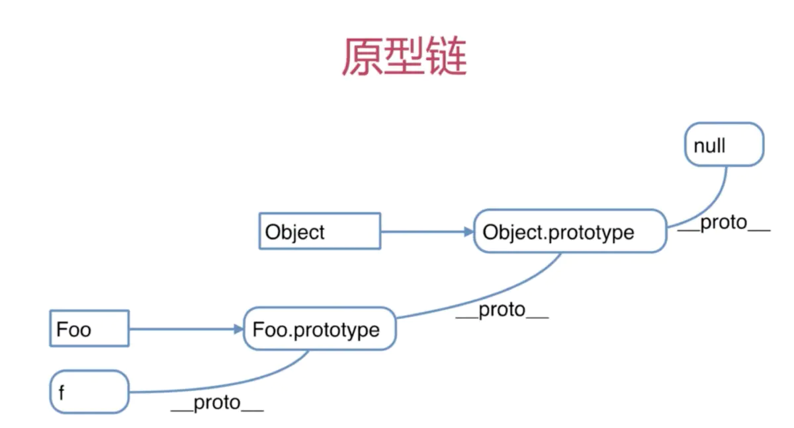
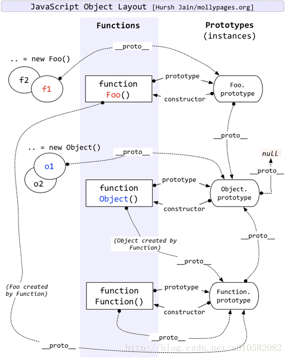

# 实现进入全屏&退出全屏
```js
toggleFullScreen:function(){
    if(!this.isFullScreen){
        let el = document.documentElement;
        (el.requestFullscreen && el.requestFullscreen()) ||
        (el.mozRequestFullScreen && el.mozRequestFullScreen()) ||
        (el.webkitRequestFullscreen && el.webkitRequestFullscreen()) || (el.msRequestFullscreen && el.msRequestFullscreen());
        this.isFullScreen = 1;
    }else{
        document.exitFullscreen ? document.exitFullscreen() :
        document.mozCancelFullScreen ? document.mozCancelFullScreen() :
        document.webkitExitFullscreen ? document.webkitExitFullscreen() : '';
        this.isFullScreen = 0;
    }
}
```

# 重新加载
全屏下使用会退出全屏
```js
document.location.reload()
```

# XMLHttpRequest对象

# typeof与instanceof
typeof可以返回一个数据的类型，但是null、array、object,Boolean,Date都会返回object，这是typeof的局限
对于未定义变量可以返回undefined，常用于判断变量是否有值if(type(a)!="undefined")
instanceof用于测试一个对象在其原型链中是否存在一个构造函数的 prototype 属性 
object（要检测的对象）instanceof constructor（某个构造函数）object是constructor的实例？
注意Array是Object的子类
Array.isArray()也可用于判断是否数组


# js正则
## 修饰符
/i 大小写不敏感  
/g 执行全局匹配  
/m 执行多行匹配  

## 模式
方括号内的任意一个，可以是范围可以是一些值，加了^表示取反  
[a-z]  
[0-9]  
[abc]  
[^abc] abc之外的数  

()该括号一般配合｜表示或  
(a|b)  

元字符  
. => 表示单个字符，除了换行和行结束符 \n  
\w => 查找单词字符,相当于 [a-zA-Z0-9_]  
\W => 查找废单词字符，相当于\w取反 [^a-zA-Z0-9_]  
\d => 查找数字 [0-9]  
\D => 查找非数字 [^0-9]  
\s => 查找空白字符  
\S => 查找非空白字符  
\b => 匹配单词边界  
\B => 匹配非单词边界  
\0 => 查找Null 字符串中有\u0000 \0  
\n => 换行符  
\f => 换页符 字符串中有\f  
\r => 回车符号（return）  
\t => 制表符（table）  
\v => 垂直制表符  
\xxx => 八进制  
\xdd => 十六进制  
\uxxxx => Unicode字符  

量词
n+ 包含至少一个n  
n* 零个或多个n，任意个数  
n? 零个或一个   
n{x} 含x个n  
n{x,y} 含x-y个n  
n{x,} 含至少x个n  
n$ 以n结尾  
^n 以n开始  
?=n 其后紧接字符串n  
?!n 其后非紧接n  

RegExp对象属性  
global 是否具有标志g  
ignoreCase 是有具有标志i  
lastIndex 一个整数，标示开始下一次匹配的字符位置  
multiline 是否具有标志m  
source 正则表达式源文本
flags

RegExp对象方法  
compile() 编译正则表达式或改写  
exec() 检索字符串中指定的值。返回找到的值，并确定其位 置。
test() 是否含有，返回true OR false  

支持正则表达式的String对象的方法  
search() 返回源字符串中第一次匹配位置  
match() 找到全部匹配的字符串，返回匹配字符串的数组，  非/g可返回第一次匹配的位置  
replace() 替换  
split() 拆分  
```js
let reg = /[a-z]/

// 模版字符串
/.+?/ //为惰性匹配
/.+/ // 贪婪匹配
let obj = {
  who: 'hwg',
  year: 24,
  city: '衢州'
}
let a = '{{who}} are {{year}} old, He/She is from {{city}}'
let reg = /\{\{(.+?)\}\}/g
out(a.replace(reg,(a,b,c,d) =>{
  console.log(a,b,c,d)
}))
```


# JS对象
## JS Array
属性：
constructor   => 返回对创建此对象的数组函数的引用
length        => 数组长度
prototype     => 通过数组原型向对象添加属性和方法
```js
let a = new Array()
console.log(a.constructor == Array) // true
console.log(a.length) // 0
Array.prototype.a = function(){
  console.log(this) // Array
}
Array.prototype.b = ''
```

方法：
concat()   =>  把数组连接起来 a.concat(b)  a.concat(b,c)
join() => 通过指定分隔符将数组连接起来 [1,2].join('-') // 1-2
pop() => 删除并返回数组的最后一个元素
push() => 向数组的末尾添加一个或更多元素，并返回新的长度
reverse() => 颠倒数组中元素的顺序
shift() => 删除并返回数组的第一个元素
slice(start,end) => 从某个已有的数组返回选定的元素，start必须，end可选
sort() => 对数组按照字符串顺序排序，要实现数字排序需传入一个函数作为参数，如下
```js
let a = [1,4,5,7,8,2,3,5]
a.sort((a,b)=>a-b)// 升序 a<b 表示是a在b前
a.sort((a,b)=>b-a)// 降序
```
splice() => 删除指定个数的元素，也可在指定位置添加元素
```js
splice(-1) //删除并返回最后一个元素
splice(3,1) //删除并返回从位置3开始的1个元素
splice(3,0,3,...) //在位置3添加元素3,...
```
toString() => 转换成字符串
toLocaleString() => 有点复杂了，把数组转换为本地数组
unshift() => 向数组的开头添加一个或更多个元素，返回数组长度
valueOf() => 返回数组对象的原始值

## JS Boolean
属性：
constructor => 返回对创建此对象的 Boolean 函数的引用
prototype => 向对象添加属性和方法

方法：
toString()
toSource()
valueOf()

## JS DATE
属性：
constructor => 返回对创建此对象的 Date 函数的引用
prototype => 向对象添加属性和方法

方法：
有点多

## JS Math
属性：E,LN2,LN10,LOG2E,LOG10E,PI,SQRT1_2,SQRT2
方法：
abs(x) => 返回x的绝对值
acos(x) => 返回x的反余弦值
asin(x) => 返回x的反正弦值
atan(x) => 以介于 -PI/2 与 PI/2 弧度之间的数值返回x的反正切值
atan2(y,x) => 返回从 x 轴到点 (x,y) 的角度（介于 -PI/2 与 PI/2 弧度之间）
ceil(x) => 对数进行上舍入  Math.ceil(2.2) // 3
cos(x) => 返回x的余弦值
exp(x) => 返回e的指数
floor(x) => 对数进行下舍入
log(x) => 返回x对自然对数，以e为底
max(x,y) => 返回x，y中较大值
min(x,y) => 返回x，y中较小值
pow(x,y) => 返回x的y次幂
random() => 返回0-1之间的随机数[0,1)
round(x) => 四舍五入
sin(x) => 正弦值
sqrt(x) => x的平方根
tan(x) => x的正切
toSource() => 
valueOf() =>

## JS Number
属性：
constructor => 
MAX_VALUE => 可表示的最大数
MIN_VALUE => 可表示的最小数
NaN => 非数字值
NEGATIVE_INFINITY => 负无穷大，溢出时返回该值
POSITIVE_INFINITY => 正无穷大，溢出时返回该值
prototype => 

方法：
toString() => 把数字转换成字符串
toLocaleString()
toFixed() => 把数字转换为字符串，结果的小数点后有指定位数的数字
toExponential() => 把对象的值转换为指数计数法
toPrecision() => 把数字格式化为指定的长度
valueOf() => 

## JS String
属性：
constructor => 
length => 
prototype => 

方法：
anchor() => 创建 HTML 锚  a.anchor('hwg') => <a name="hwg">a</a>
big() => a.big() => <big>a</big>
blink()	=> <blink>a</blink>
bold()	<b></b>
charAt()	返回在指定位置的字符。
charCodeAt()	返回在指定的位置的字符的 Unicode 编码。
concat()	连接字符串。
fixed()	以打字机文本显示字符串。<tt>a</tt>
fontcolor()	使用指定的颜色来显示字符串。
fontsize()	使用指定的尺寸来显示字符串。
fromCharCode()	从字符编码创建一个字符串。
indexOf()	检索字符串。
italics()	使用斜体显示字符串。<i>a</i>
lastIndexOf()	从后向前搜索字符串。
link(x)	将字符串显示为链接。<a href="x">a</a>
localeCompare()	用本地特定的顺序来比较两个字符串。 a < b => <0 
match()	找到一个或多个正则表达式的匹配。
replace()	替换与正则表达式匹配的子串。
search()	检索与正则表达式相匹配的值。
slice()	提取字符串的片断，并在新的字符串中返回被提取的部分。
small()	使用小字号来显示字符串。
split()	把字符串分割为字符串数组。
strike()	使用删除线来显示字符串。<strike>a</strike>
sub()	把字符串显示为下标。<sub>a</sub>
substr()	从起始索引号提取字符串中指定数目的字符。  第二个参数为数目
substring()	提取字符串中两个指定的索引号之间的字符。 第二个参数为索引
sup()	把字符串显示为上标。<sup>a</sup>
toLocaleLowerCase()	把字符串转换为小写。
toLocaleUpperCase()	把字符串转换为大写。
toLowerCase()	把字符串转换为小写。
toUpperCase()	把字符串转换为大写。
toSource()	代表对象的源代码。
toString()	返回字符串。
valueOf()	返回某个字符串对象的原始值。

# BOM对象

## window 对象
Window 对象表示浏览器中打开的窗口，如果文档包含框架（frame 或 iframe 标签），为每个框架创建一个额外的 window 对象  
属性：
closed	返回窗口是否已被关闭。
defaultStatus	设置或返回窗口状态栏中的默认文本。
document	对 Document 对象的只读引用。请参阅 Document 对象。
history	对 History 对象的只读引用。请参数 History 对象。
innerheight	返回窗口的文档显示区的高度。
innerwidth	返回窗口的文档显示区的宽度。
length	设置或返回窗口中的框架数量。
location	用于窗口或框架的 Location 对象。请参阅 Location 对象。
name	设置或返回窗口的名称。
Navigator	对 Navigator 对象的只读引用。请参数 Navigator 对象。
opener	返回对创建此窗口的窗口的引用。
outerheight	返回窗口的外部高度。
outerwidth	返回窗口的外部宽度。
pageXOffset	设置或返回当前页面相对于窗口显示区左上角的 X 位置。
pageYOffset	设置或返回当前页面相对于窗口显示区左上角的 Y 位置。
parent	返回父窗口。
Screen	对 Screen 对象的只读引用。请参数 Screen 对象。
self	返回对当前窗口的引用。等价于 Window 属性。
status	设置窗口状态栏的文本。
top	返回最顶层的先辈窗口。
window	window 属性等价于 self 属性，它包含了对窗口自身的引用。
screenLeft
screenTop
screenX
screenY
只读整数。声明了窗口的左上角在屏幕上的的 x 坐标和 y 坐标。IE、Safari 和 Opera 支持 screenLeft 和 screenTop，而 Firefox 和 Safari 支持 screenX 和 screenY。

方法：
alert()	显示带有一段消息和一个确认按钮的警告框。
blur()	把键盘焦点从顶层窗口移开。
clearInterval()	取消由 setInterval() 设置的 timeout。
clearTimeout()	取消由 setTimeout() 方法设置的 timeout。
close()	关闭浏览器窗口。
confirm()	显示带有一段消息以及确认按钮和取消按钮的对话框。
createPopup()	创建一个 pop-up 窗口。
focus()	把键盘焦点给予一个窗口。
moveBy()	可相对窗口的当前坐标把它移动指定的像素。
moveTo()	把窗口的左上角移动到一个指定的坐标。
open()	打开一个新的浏览器窗口或查找一个已命名的窗口。
print()	打印当前窗口的内容。
prompt()	显示可提示用户输入的对话框。
resizeBy()	按照指定的像素调整窗口的大小。
resizeTo()	把窗口的大小调整到指定的宽度和高度。
scrollBy()	按照指定的像素值来滚动内容。
scrollTo()	把内容滚动到指定的坐标。
setInterval()	按照指定的周期（以毫秒计）来调用函数或计算表达式。
setTimeout()	在指定的毫秒数后调用函数或计算表达式。


## Navigator
Navigator 对象包含有关浏览器的信息。

Navigator 对象集合:
plugins[] => 返回对文档中所有嵌入式对象的引用。该集合是一个 Plugin 对象的数组，其中的元素代表浏览器已经安装的插件。Plug-in 对象提供的是有关插件的信息，其中包括它所支持的 MIME 类型的列表。虽然 plugins[] 数组是由 IE 4 定义的，但是在 IE 4 中它却总是空的，因为 IE 4 不支持插件和 Plugin 对象。  
 
属性：
appCodeName	返回浏览器的代码名。
appMinorVersion	返回浏览器的次级版本。
appName	返回浏览器的名称。
appVersion	返回浏览器的平台和版本信息。
browserLanguage	返回当前浏览器的语言。
cookieEnabled	返回指明浏览器中是否启用 cookie 的布尔值。
cpuClass	返回浏览器系统的 CPU 等级。
onLine	返回指明系统是否处于脱机模式的布尔值。
platform	返回运行浏览器的操作系统平台。
systemLanguage	返回 OS 使用的默认语言。
userAgent	返回由客户机发送服务器的 user-agent 头部的值。
userLanguage	返回 OS 的自然语言设置。

方法：
javaEnabled()	规定浏览器是否启用 Java。
taintEnabled()	规定浏览器是否启用数据污点 (data tainting)。

## Screen 对象
Screen 对象包含有关客户端显示屏幕的信息。

属性：
availHeight	返回显示屏幕的高度 (除 Windows 任务栏之外)。
availWidth	返回显示屏幕的宽度 (除 Windows 任务栏之外)。
bufferDepth	设置或返回调色板的比特深度。
colorDepth	返回目标设备或缓冲器上的调色板的比特深度。
deviceXDPI	返回显示屏幕的每英寸水平点数。
deviceYDPI	返回显示屏幕的每英寸垂直点数。
fontSmoothingEnabled	返回用户是否在显示控制面板中启用了字体平滑。
height	返回显示屏幕的高度。
logicalXDPI	返回显示屏幕每英寸的水平方向的常规点数。
logicalYDPI	返回显示屏幕每英寸的垂直方向的常规点数。
pixelDepth	返回显示屏幕的颜色分辨率（比特每像素）。
updateInterval	设置或返回屏幕的刷新率。
width	返回显示器屏幕的宽度

## History
History 对象包含用户（在浏览器窗口中）访问过的 URL。  
History 对象是 window 对象的一部分，可通过 window.history 属性对其进行访问。

属性：
length => 返回浏览器历史列表中的 URL 数量

方法：
back() => 加载 history 列表中的前一个 URL
forward() => 加载 history 列表中的下一个 URL
go() => 加载 history 列表中的某个具体页面

## Location对象
Location 对象包含有关当前 URL 的信息
Location 对象是 Window 对象的一个部分，可通过 window.location 属性来访问

属性：
hash	设置或返回从井号 (#) 开始的 URL（锚）。
host	设置或返回主机名和当前 URL 的端口号。
hostname	设置或返回当前 URL 的主机名。
href	设置或返回完整的 URL。
pathname	设置或返回当前 URL 的路径部分。
port	设置或返回当前 URL 的端口号。
protocol	设置或返回当前 URL 的协议。
search	设置或返回从问号 (?) 开始的 URL（查询部分）。
方法：
assign()	加载新的文档。
reload()	重新加载当前文档。
replace()	用新的文档替换当前文档。


# DOM 对象

## Document
每个载入浏览器的 HTML 文档都会成为 Document 对象

对象集合：
all[] => 提供对文档中所有 HTML 元素的访问
anchors[] => 返回对文档中所有 Anchor 对象的引用 a标签
applets => 返回对文档中所有 Applet 对象的引用 java小程序
forms[] => 返回对文档中所有 Form 对象引用
images[] => 返回对文档中所有 Image 对象引用
links[] => 返回对文档中所有 Area 和 Link 对象引用

对象属性：
body	提供对 <body> 元素的直接访问。对于定义了框架集的文档，该属性引用最外层的 <frameset>。
cookie	设置或返回与当前文档有关的所有 cookie。
domain	返回当前文档的域名。
lastModified	返回文档被最后修改的日期和时间。
referrer	返回载入当前文档的文档的 URL。
title	返回当前文档的标题。
URL	返回当前文档的 URL。

对象方法：
close()	关闭用 document.open() 方法打开的输出流，并显示选定的数据。
getElementById()	返回对拥有指定 id 的第一个对象的引用。
getElementsByName()	返回带有指定名称的对象集合。
getElementsByTagName()	返回带有指定标签名的对象集合。
open()	打开一个流，以收集来自任何 document.write() 或 document.writeln() 方法的输出。
write()	向文档写 HTML 表达式 或 JavaScript 代码。
writeln()	等同于 write() 方法，不同的是在每个表达式之后写一个换行符。

## Element
在 HTML DOM 中，Element 对象表示 HTML 元素

属性和方法：
element.accessKey	设置或返回元素的快捷键。不同的浏览器激活方式不一样，需配合额外的按键一起触发
element.appendChild()	向元素添加新的子节点，作为最后一个子节点。仅支持添加节点
element.attributes	返回元素属性的 NamedNodeMap。
element.childNodes	返回元素子节点的 NodeList。
element.className	设置或返回元素的 class 属性。
element.clientHeight	返回元素的可见高度。
element.clientWidth	返回元素的可见宽度。
element.cloneNode()	克隆元素。
element.compareDocumentPosition()	比较两个元素的文档位置。
element.contentEditable	设置或返回元素的文本方向。
element.dir	设置或返回元素的内容是否可编辑。
element.firstChild	返回元素的首个子。
element.getAttribute()	返回元素节点的指定属性值。
element.getAttributeNode()	返回指定的属性节点。
element.getElementsByTagName()	返回拥有指定标签名的所有子元素的集合。
element.getFeature()	返回实现了指定特性的 API 的某个对象。
element.getUserData()	返回关联元素上键的对象。
element.hasAttribute()	如果元素拥有指定属性，则返回true，否则返回 false。
element.hasAttributes()	如果元素拥有属性，则返回 true，否则返回 false。
element.hasChildNodes()	如果元素拥有子节点，则返回 true，否则 false。
element.id	设置或返回元素的 id。
element.innerHTML	设置或返回元素的内容。
element.insertBefore()	在指定的已有的子节点之前插入新节点。
element.isContentEditable	设置或返回元素的内容。
element.isDefaultNamespace()	如果指定的 namespaceURI 是默认的，则返回 true，否则返回 false。
element.isEqualNode()	检查两个元素是否相等。
element.isSameNode()	检查两个元素是否是相同的节点。
element.isSupported()	如果元素支持指定特性，则返回 true。
element.lang	设置或返回元素的语言代码。
element.lastChild	返回元素的最后一个子元素。
element.namespaceURI	返回元素的 namespace URI。
element.nextSibling	返回位于相同节点树层级的下一个节点。
element.nodeName	返回元素的名称。
element.nodeType	返回元素的节点类型。
element.nodeValue	设置或返回元素值。
element.normalize()	合并元素中相邻的文本节点，并移除空的文本节点。
element.offsetHeight	返回元素的高度。
element.offsetWidth	返回元素的宽度。
element.offsetLeft	返回元素的水平偏移位置。
element.offsetParent	返回元素的偏移容器。
element.offsetTop	返回元素的垂直偏移位置。
element.ownerDocument	返回元素的根元素（文档对象）。
element.parentNode	返回元素的父节点。
element.previousSibling	返回位于相同节点树层级的前一个元素。
element.removeAttribute()	从元素中移除指定属性。
element.removeAttributeNode()	移除指定的属性节点，并返回被移除的节点。
element.removeChild()	从元素中移除子节点。
element.replaceChild()	替换元素中的子节点。
element.scrollHeight	返回元素的整体高度。
element.scrollLeft	返回元素左边缘与视图之间的距离。
element.scrollTop	返回元素上边缘与视图之间的距离。
element.scrollWidth	返回元素的整体宽度。
element.setAttribute()	把指定属性设置或更改为指定值。
element.setAttributeNode()	设置或更改指定属性节点。
element.setIdAttribute()	
element.setIdAttributeNode()	
element.setUserData()	把对象关联到元素上的键。
element.style	设置或返回元素的 style 属性。
element.tabIndex	设置或返回元素的 tab 键控制次序。
element.tagName	返回元素的标签名。
element.textContent	设置或返回节点及其后代的文本内容。
element.title	设置或返回元素的 title 属性。
element.toString()	把元素转换为字符串。
nodelist.item()	返回 NodeList 中位于指定下标的节点。
nodelist.length	返回 NodeList 中的节点数。

## Attribute
属性和方法：
attr.isId	如果属性是 id 类型，则返回 true，否则返回 false。
attr.name	返回属性的名称。
attr.value	设置或返回属性的值。
attr.specified	如果已指定属性，则返回 true，否则返回 false。
nodemap.getNamedItem()	从 NamedNodeMap 返回指定的属性节点。
nodemap.item()	返回 NamedNodeMap 中位于指定下标的节点。
nodemap.length	返回 NamedNodeMap 中的节点数。
nodemap.removeNamedItem()	移除指定的属性节点。
nodemap.setNamedItem()	设置指定的属性节点（通过名称）。

## Event
事件行为：
onabort	图像的加载被中断。
onblur	元素失去焦点。
onchange	域的内容被改变。
onclick	当用户点击某个对象时调用的事件句柄。
ondblclick	当用户双击某个对象时调用的事件句柄。
onerror	在加载文档或图像时发生错误。
onfocus	元素获得焦点。
onkeydown	某个键盘按键被按下。
onkeypress	某个键盘按键被按下并松开。
onkeyup	某个键盘按键被松开。
onload	一张页面或一幅图像完成加载。
onmousedown	鼠标按钮被按下。
onmousemove	鼠标被移动。
onmouseout	鼠标从某元素移开。
onmouseover	鼠标移到某元素之上。
onmouseup	鼠标按键被松开。
onreset	重置按钮被点击。
onresize	窗口或框架被重新调整大小。
onselect	文本被选中。
onsubmit	确认按钮被点击。
onunload	用户退出页面。

鼠标/键盘属性：
altKey	返回当事件被触发时，"ALT" 是否被按下。
button	返回当事件被触发时，哪个鼠标按钮被点击。
clientX	返回当事件被触发时，鼠标指针的水平坐标。
clientY	返回当事件被触发时，鼠标指针的垂直坐标。
ctrlKey	返回当事件被触发时，"CTRL" 键是否被按下。
metaKey	返回当事件被触发时，"meta" 键是否被按下。
relatedTarget	返回与事件的目标节点相关的节点。
screenX	返回当某个事件被触发时，鼠标指针的水平坐标。
screenY	返回当某个事件被触发时，鼠标指针的垂直坐标。
shiftKey	返回当事件被触发时，"SHIFT" 键是否被按下。

标准Event属性：
bubbles	返回布尔值，指示事件是否是起泡事件类型。
cancelable	返回布尔值，指示事件是否可拥可取消的默认动作。
currentTarget	返回其事件监听器触发该事件的元素。
eventPhase	返回事件传播的当前阶段。
target	返回触发此事件的元素（事件的目标节点）。
timeStamp	返回事件生成的日期和时间。
type	返回当前 Event 对象表示的事件的名称

标准 Event 方法：
initEvent()	初始化新创建的 Event 对象的属性。
preventDefault()	通知浏览器不要执行与事件关联的默认动作。
stopPropagation()	不再派发事件

# 原型与原型链
每一个JS对象（null除外）在创建的时候会关联另外一个对象，该对象即是原型，每个对象会从原型继承属性
每一个函数都有一个prototype属性
每一个对象都有一个proto属性（__proto__）指向对象的原型，即方法（函数）的prototype属性  
对象.__proto__ = 方法.prototype  <= 对象 = new 方法  
每个原型都有一个 constructor 属性指向关联的构造函数 实例原型指向构造函数

原型链也就是object原型一直继承到创建该对象的这条链


```js
function Person(name){
  this.name = name
}
Person.prototype.eat = function(){
  console.log(this.name+'is eatting !')
}
let p1 = new Person('hwg')
p1.eat()
console.log(p1.__proto__) // 指向对象的原型，即Person
console.log(Person.prototype) // 该函数的原型,
console.log(Person.prototype.constructor) //指向构造函数
```

# 闭包
闭包就是能够读取其它函数内部的变量的函数，或者说定义在一个函数内部的函数  
作用：一个是前面提到的可以读取函数内部的变量，另一个就是让这些变量的值始终保持在内存中。  
```js
function fnn(){
  var a = 0;
  return function(){
    a = a +1
    return a
  }
}
var a = fnn()
a() // 1
a() // 2
```


# 垃圾回收
执行环境负责在代码执行时管理内存，通过自动内存管理实现内存分配和闲置资源回收